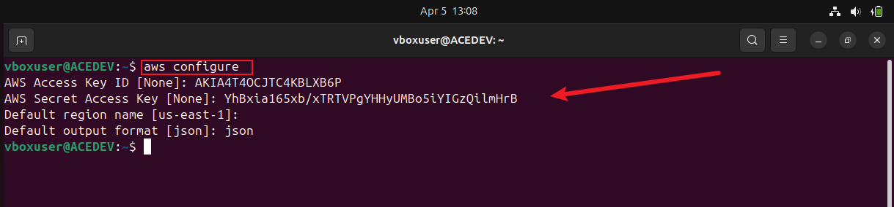

# Secure-Authentication-to-AWS-API
Setting up a secure Authentication to AWS API

## 1. Create Programmatic Access Credentials
What: Generate Access Key ID and Secret Access Key

Why: These are used by your script to access AWS services via the CLI.

Store these securely and use them to configure AWS CLI:

CLI command:
aws configure

After this setup:

The automation_user will have full EC2 and S3 access and my shell script can now use AWS CLI authenticated with these credentials.

After setting up the AWS account and creating the necessary IAM user and permissions, the next step involves installing AWS commandline interface (CLI) which allows the interaction with AWS services directly from my terminal, enabling automation and simplification of AWS resource management

## 2. Download and install AWS CLI

* Download: The command "curl "https://awscli.amazonaws.com/awscli-exe-linux-x86_64.zip" -o "awscliv2.zip" is used to download the installer file from the amazon server.

* Unzip: The installer file which in a zip format is unzipped with the command "unzip awscliv2.zip"

* Install: The command "sudo ./aws/install" is used to run the installer file that has bveen unzipped

## 3. Configuring the AWS CLI
i. open the terminal and enter the prompt "aws configure" which would then require the AWS accesskey ID and AWS Secret Access Key for the automation user(Note: this was generated in step 1):

ii. Verify that the AWS CLI is configured correctly and can communicate with the AWS service using the command "aws ec2 describe-regions --output table"

## 5. Create an IAM Policy
What: A JSON document that allows actions like creating EC2 and S3 resources.

Why: To grant specific permissions for script operations.

 Policy (JSON):

    {

    "Version": "2012-10-17",

     "Statement": [

    {
      "Effect": "Allow",
      "Principal": {
        "Service": "ec2.amazonaws.com"
      },
      "Action": "sts:AssumeRole"
    }
     ]
  
    }

CLI command:
aws iam create-policy --policy-name EC2S3FullAccess \ --policy-document file://ec2-s3-policy.json

## 5. Create an IAM Role
what: A role that defines a set of permissions.

Why: Though this is more common for EC2 or Lambda, it's mentioned here as part of a full setup.

Console: IAM → Roles → Create Role → Choose trusted entity (usually AWS service)

CLI command:
aws iam create-role --role-name AutomationRole \
  --assume-role-policy-document file://trust-policy.json

## 6. Create an IAM User
What: A user named automation_user

Why: This is the identity your script uses.

CLI command:
aws iam create-user --user-name automation_user

## 7. Assign the User to the IAM Role (Optional based on setup)
What: Allow automation_user to assume the role if needed.

CLI command (Attach trust policy to allow assume-role):the three command below are used consecutively to attach the policy to the user:

aws iam attach-user-policy --user-name automation_user --policy-arn arn:aws:iam::aws:policy/AmazonEC2FullAccess

aws iam attach-user-policy --user-name automation_user --policy-arn arn:aws:iam::aws:policy/AmazonS3FullAccess

aws iam list-policies --query "Policies[?PolicyName=='AmazonEC2FullAccess']"

## 8. Attach IAM Policy to the User
What: Directly attach the policy "EC2S3FullAccess"

     
    {

    "Version": "2012-10-17",
   
    "Statement": [

    {
      "Effect": "Allow",
      "Action": [
        "ec2:*"
      ],
      "Resource": "*"
    },
    {
      "Effect": "Allow",
      "Action": [
        "s3:*"
      ],
      "Resource": "*"
    }
   
    ]

    }

Then create the policy using the command line "aws iam create-policy --policy-name EC2S3FullAccess --policy-document file://ec2s3-policy.json"

After creating the policy, you can attach it to the user using the command line "aws iam attach-user-policy --user-name automation_user --policy-arn arn:aws:iam::123456789012:policy/EC2S3FullAccess"

